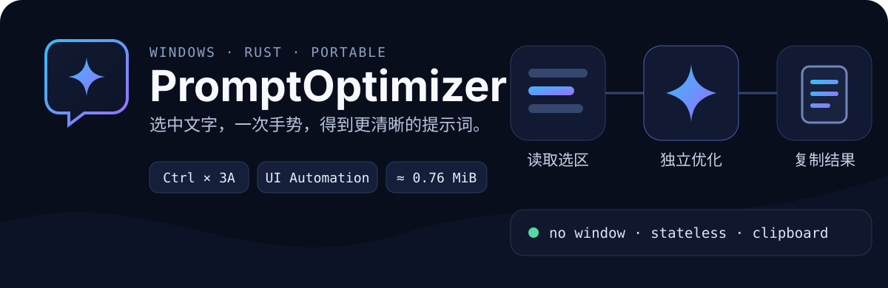

<p align="center">
  
</p>

<p align="center">
  <strong>一款轻量、无主窗口的 Windows 提示词优化工具。</strong><br>
  选中文字，按住 <kbd>Ctrl</kbd> 快速三击 <kbd>A</kbd>，优化结果自动进入剪贴板。
</p>

<p align="center">
  Windows 10/11 · Rust 2021 · OpenAI-compatible API · Portable
</p>

## 为什么使用 PromptOptimizer

PromptOptimizer 常驻系统托盘，把“选区 → 优化 → 粘贴”压缩成一次快捷操作。它不打开聊天窗口，不维护会话历史，也不会在输入侧读写剪贴板。

- **直接读取选区**：通过 Windows UI Automation 获取当前焦点控件中的选中文字，不模拟 `Ctrl+C`。
- **单轮无状态请求**：每次只发送本次选区和当前优化规则，使用任务 ID 隔离连续请求。
- **轻量常驻**：无 GUI 框架、无异步运行时、无控制台窗口；Release EXE 当前约 0.76 MiB。
- **安静反馈**：在当前输入位置附近复用同一个小型状态框，显示“优化中…”和“已复制”。
- **兼容服务**：调用 OpenAI 兼容的 `/chat/completions` 接口，可配置地址、模型和采样参数。
- **绿色运行**：单个 EXE 即可启动，配置与程序放在同一目录；支持当前用户开机自启。

## 快速开始

### 1. 准备程序

将 `PromptOptimizer.exe` 放入普通用户可写目录并运行。首次启动会在 EXE 同目录创建 UTF-8 编码的 `config.json`。

也可以从源码构建：

```powershell
cargo build --release
```

生成文件位于 `target\release\PromptOptimizer.exe`。

### 2. 配置模型

右键托盘图标，选择 **设置**，至少填写 `api_key`，并确认服务地址和模型名称可用：

```json
{
  "api_key": "YOUR_API_KEY",
  "base_url": "https://api.openai.com/v1",
  "model": "gpt-4o-mini",
  "hotkey": "Ctrl+TripleA",
  "temperature": 0.3,
  "max_tokens": 512,
  "system_prompt": "你是提示词优化助手……只返回优化后的提示词。",
  "result_mode": "clipboard",
  "play_sound": true,
  "auto_start": false
}
```

保存后，在托盘菜单中选择 **重新加载配置**。

> `base_url` 应指向 API 根路径，例如 `https://api.openai.com/v1`；程序会自动追加 `/chat/completions`。不要提交或分享包含真实 API Key 的配置文件。

### 3. 完成第一次优化

1. 在支持 Windows UI Automation 文本选区的应用中选中一段提示词。
2. 按住 <kbd>Ctrl</kbd>，在约 0.52 秒间隔内快速按三次 <kbd>A</kbd>。
3. 等待状态框从“优化中…”变为“已复制”。
4. 按 <kbd>Ctrl</kbd> + <kbd>V</kbd> 粘贴优化结果。

未完成三击时，原本的 `Ctrl+A` 会在短暂等待后正常传给当前应用。

## 工作方式

```text
当前焦点控件的选区
        │  Windows UI Automation
        ▼
本次文本 + 配置中的优化规则
        │  独立、无状态的单轮请求
        ▼
OpenAI-compatible /chat/completions
        │  choices[0].message.content
        ▼
Unicode 文本写入剪贴板
```

程序只允许一个优化任务同时运行。网络请求由唯一工作线程处理，Win32 主线程继续响应托盘、热键和状态提示。

## 热键

默认值为：

```json
"hotkey": "Ctrl+TripleA"
```

支持以下格式：

- `Ctrl+TripleA`：按住 Ctrl，快速三击 A。
- `Ctrl+DoubleA`：按住 Ctrl，快速双击 A，更容易误触。
- 普通组合键：修饰键 `Ctrl` / `Alt` / `Shift` / `Win` 加 `A–Z`、`0–9` 或 `F1–F24`。

普通组合键必须包含至少一个修饰键；`F12` 为系统保留键，不可使用。

## 托盘菜单

- **设置**：用系统默认编辑器打开 `config.json`。
- **重新加载配置**：事务式校验并应用模型、热键和开机自启变更。
- **退出**：注销热键、移除托盘图标并结束程序。

Explorer 重启后，托盘图标会自动恢复；命名互斥量用于防止重复启动。

## 隐私与边界

- 输入侧不读取、不覆盖剪贴板，也不模拟 `Ctrl+C`；输出侧只写入最终 Unicode 文本。
- 仅向配置的 API 服务发送当前选中文字、系统提示词和请求参数。
- API Key 以明文保存在本地 `config.json`，不会写入常规运行日志。
- 部分游戏、远程桌面、自绘控件以及未公开 UI Automation 文本选区的应用无法直接读取选中文字。
- 当前只支持 Windows 和 `result_mode = "clipboard"`；不支持流式输出和图形化设置窗口。

## 开发与验证

项目使用 `stable-x86_64-pc-windows-msvc` 工具链。提交前建议依次运行：

```powershell
cargo fmt --all -- --check
cargo check
cargo clippy --all-targets --all-features -- -D warnings
cargo test
cargo build --release
```

Release 配置启用了体积优化、LTO、单 codegen unit、`panic = "abort"` 和符号剥离。

## 项目结构

```text
PromptOptimizer/
├── assets/                 # 应用图标与 Windows 资源
│   └── readme/             # GitHub README 视觉资产
├── docs/
│   └── spec.md             # 初始开发规范
├── src/
│   ├── api.rs              # 无状态 API 请求与响应解析
│   ├── config.rs           # 配置生成、校验与恢复
│   ├── hotkey.rs           # 普通组合键和多击手势解析
│   └── windows_app/        # UI Automation、剪贴板输出与自启
├── build.rs                # EXE 图标资源编译
└── Cargo.toml
```

详细设计背景见 [初始开发规范](./docs/spec.md)。该文档记录项目最初目标；当前行为以代码、测试和本 README 为准。

